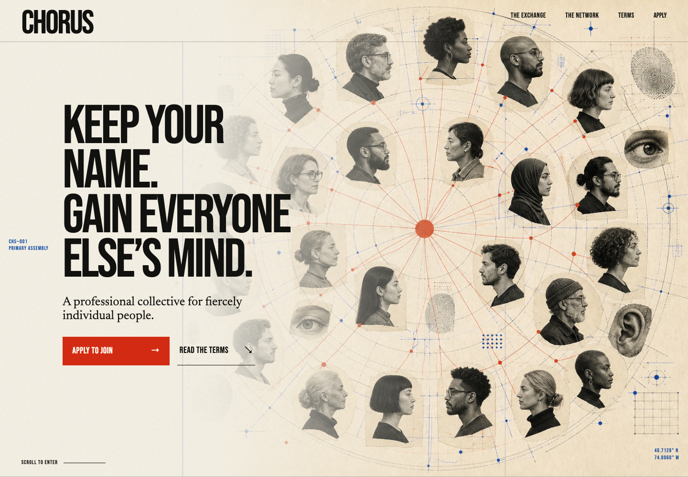

# CHORUS — a Hive Mind landing page

This landing page was built by Codex from one short prompt. This repository contains the finished site, the original prompt, the generated design reference, the frontend skills that shaped the result, and a sanitized execution trace.



## The frontend skills that mattered

| Skill | What it contributed | Original source |
| --- | --- | --- |
| **Frontend Design** | Forced a specific visual thesis instead of a generic SaaS template: bold editorial composition, expressive typography, asymmetric layout, intentional motion, and one dominant hero image. | [Anthropic’s frontend-design plugin](https://github.com/anthropics/claude-plugins-official/tree/main/plugins/frontend-design) · [exact install-era source](https://github.com/anthropics/claude-plugins-official/blob/4ca561fb8532594e7a5faef945e85096fcec0616/plugins/frontend-design/skills/frontend-design/SKILL.md) |
| **Uncodixify** | Supplied the anti-slop constraints: no pill clusters, no glass cards, no purple gradient, no fake metrics, no dashboard-like hero, and no decoration without a job. | [cyxzdev/Uncodixfy](https://github.com/cyxzdev/Uncodixfy) · [exact rules file originally installed](https://github.com/cyxzdev/Uncodixfy/blob/9dbcfb8eb89cc8ae022a8349e70dea762ac8dd6f/Uncodixfy.md) · [local adaptation used here](skills/uncodixify/RULES.md) |
| **Frontend From Generated Image** | Required an image-first workflow: generate a concrete UI reference, treat it as the direction, create the required real image asset, then verify the implementation visually. | This was a custom Adam/Codex skill, not an upstream project. It is now open sourced [in this repository](skills/frontend-from-generated-image/SKILL.md). |
| **OpenAI Image Generation** | Generated the full-page design reference and the portrait-network hero artwork. This is supporting visual infrastructure rather than a frontend-design skill. | [OpenAI Codex imagegen skill](https://github.com/openai/codex/blob/main/codex-rs/skills/src/assets/samples/imagegen/SKILL.md) |

### What was not part of the frontend method

- **Visual Plan** was inspected during preflight but was not used to plan or implement this page.
- The standalone **Screenshot** skill was not part of the design process. Screenshots and interaction checks were captured with headless Playwright.
- **Antigravity and sub-agents were not used** for the page build, following the user’s explicit test instruction.

## Original prompt

> Generate a landing page as a marketing page for joining our Hive Mind. The unique perks of our Hive Mind is that you still get your individual identity. You just pretty much have access to everyone else's mind. And you do get some objectives, but you only work for the Hive Mind one day a week from 9 to 5. You also need to pay 5% on income. In exchange, you get access to a wide network of professionals and opportunities. You come up with the name.

The chosen name was **CHORUS**, with the positioning:

> Keep your name. Gain everyone else’s mind.

See [PROMPTS.md](PROMPTS.md) for the full user prompt, follow-up instruction, and both image-generation prompts.

## What is included

```text
.
├── index.html                         # semantic page structure and copy
├── styles.css                        # responsive editorial design system
├── script.js                         # navigation, dialog, form, and motion
├── assets/chorus-network.png         # generated hero artwork
├── docs/reference-mockup.png         # generated UI reference
├── preview-desktop.png               # final desktop first fold
├── preview-mobile.png                # final mobile first fold
├── skills/
│   ├── frontend-from-generated-image # custom skill, now public
│   └── uncodixify                    # local rules used in the build
├── PROMPTS.md                        # original and image prompts
├── TRACE.md                          # curated execution trace
└── SECURITY_REVIEW.md                # publication safety review
```

## Run it locally

The page has no build step or package dependencies.

```bash
python3 -m http.server 4173
```

Then open [http://localhost:4173](http://localhost:4173).

## Verification

The finished page was checked in isolated headless Chromium at desktop and mobile widths.

- HTTP response: `200`
- Console errors: `0`
- Scroll-reveal elements activated: `17/17`
- Desktop viewport: `1440 × 1000`
- Mobile viewport: `390 × 844`
- Responsive menu: opened, closed, and navigated successfully
- Application dialog: opened, validated, submitted, and showed the success state
- Keyboard skip link: hidden at rest and visible on focus

## Provenance

The skill origins were reconstructed from the earliest relevant Codex sessions and checked against the live public repositories. Raw Codex JSONL files are intentionally not included because those long-running session archives also contain unrelated private identifiers and credential-like material. [TRACE.md](TRACE.md) preserves the publishable workflow without exposing private session data or private chain-of-thought.

## License

The original code, prompts, documentation, custom skill, and generated assets in this repository are released under the [MIT License](LICENSE). Third-party skills remain under their upstream licenses and are linked rather than vendored, except for the clearly identified local adaptations.
